## Disclaimer
This instruction has been tested with:
- Windows 10 [x64]
- JDK 8.201 [x64]
- IntelliJ IDEA Community Edition 2018.3.4 [x64]
- Github Desktop

# 1. Preparation

## 1.1. Clone this repository
Use some short name and place the folder in a the root of your disk drive.
Example: ```C:\\iDynoMICs```.
In case of using [Github Desktop](https://desktop.github.com/) you can do it in following way:

Open Github Desktop:
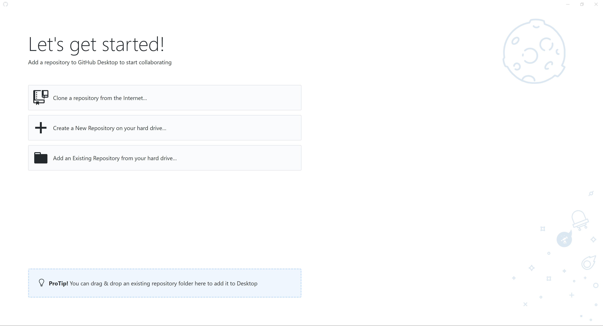
And press "Clone repository from the internet". You will receive the following window :
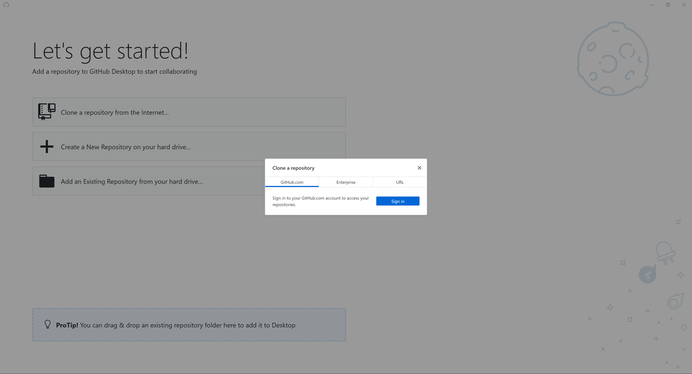
Where you need to switch to "URL" tab:

Enter the url of [this repository](https://github.com/adoloman/Modified-iDynoMICs-for-augmentation-model):

To avoid any potential problems with path length limit in your OS, it would be reasonable to use short folder name like ```iDynoMICs``` and place the clonned repository to the root of disk. In my case I placed repository to ```C:\iDynoMICs```:
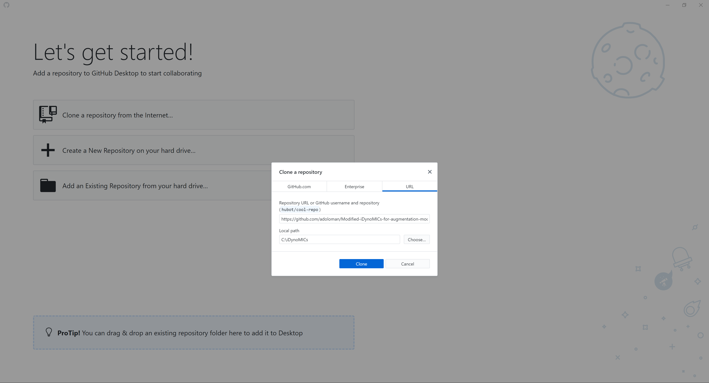
Wait till Github Desktop finish copying:
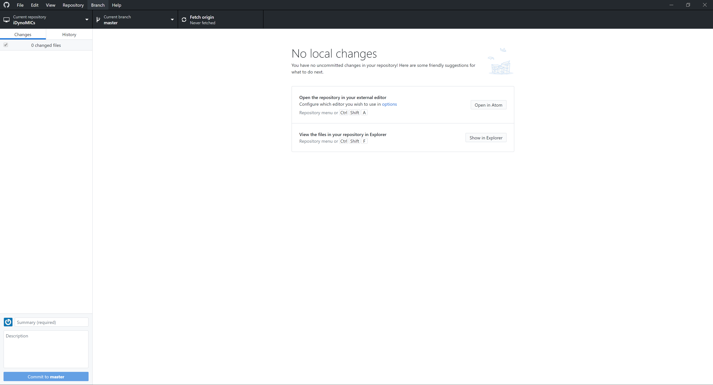
Done!

## 1.2. Install the Java SDK
Download and install [Java JDK 8](https://www.oracle.com/technetwork/java/javase/downloads/jdk8-downloads-2133151.html)

## 1.3. Install the IntelliJ IDEA
Download and install [IntelliJ IDEA](https://www.jetbrains.com/idea/download/)

# 2. Setting Up

## 2.1. Open the project in IDE

Launch the IntelliJ IDEA and you will see the following window:
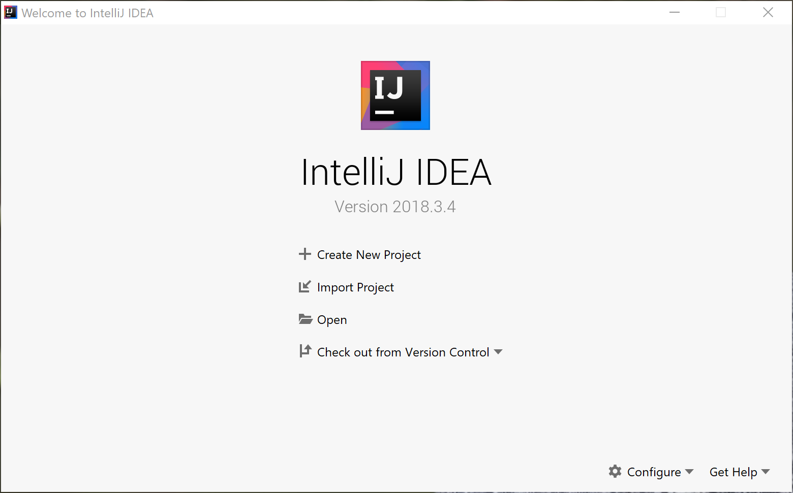
Press the "Open" and navigate to folder of clonned iDynoMICs (in my case : ```C:\iDynoMICs```)
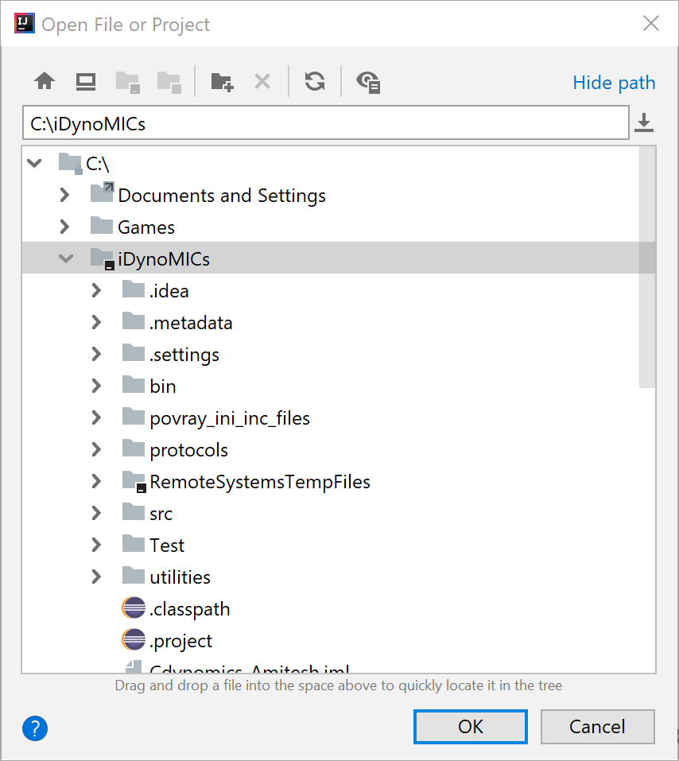
And press "OK".
Wait till the end of importing process.

## 2.2. Configure the build/run options
After fresh import the IDE may show the warning "Project SDK is not defined" and will suggest to set it up:
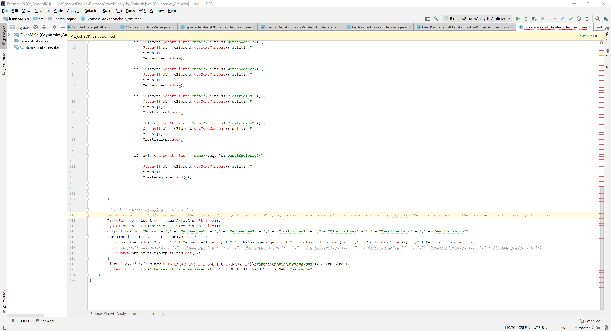
If you don't have it - got to step 2.3, otherwise: press highlighted text "Setup SDK". It will show you the list of JAVA SDK installed on your computer. Select one you want to use:

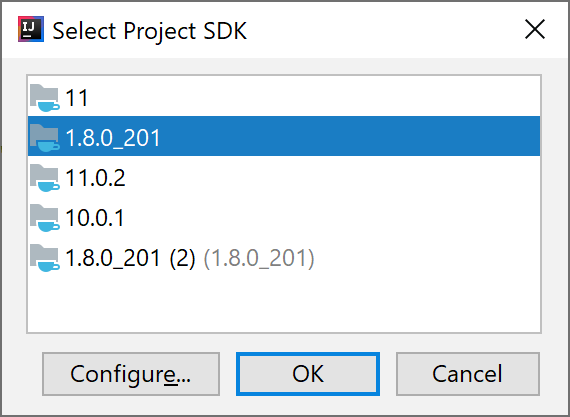

And press OK.

## 2.3. Configure the main class of project
Go to ```Run``` -> ```Edit configurations```
You will see the following window:
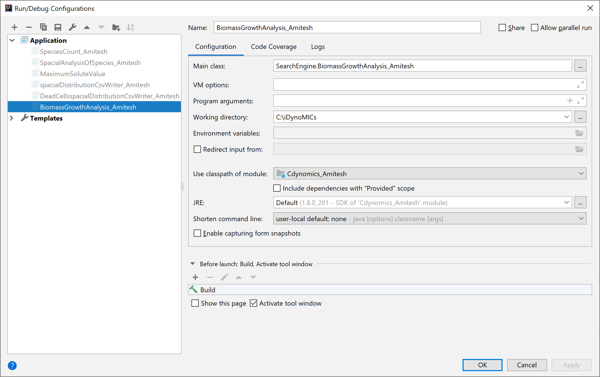

Hit the button with ```...``` to the right from Main Class field:
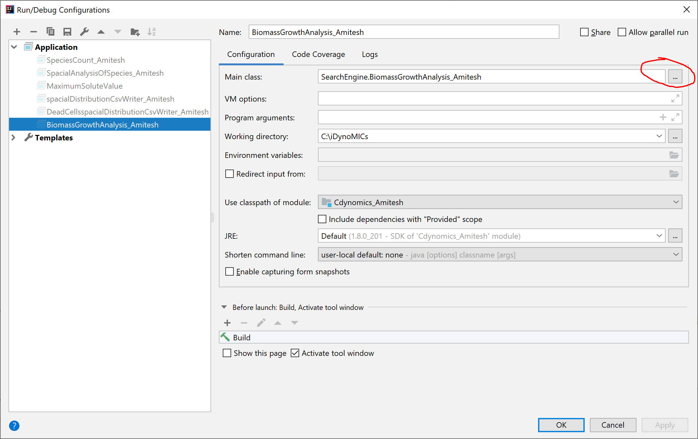
And you will get following window:

Switch to tab "Project" and switch to file located ```'iDynoMICs_root_folder'/src/idyno/Idynomics.java```
NB! : In selection window the file may be shown without extension.

In my case it is ```C:/iDynoMICs/src/idyno/Idynomics.java``` :
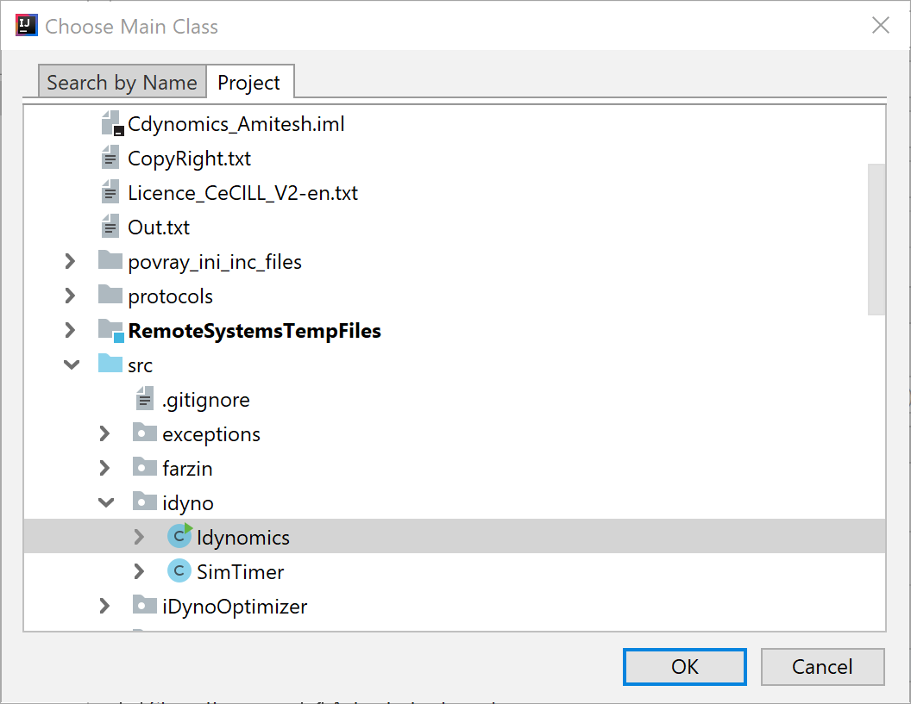
And press OK.
Now it will return to previous window, where you need to press OK.
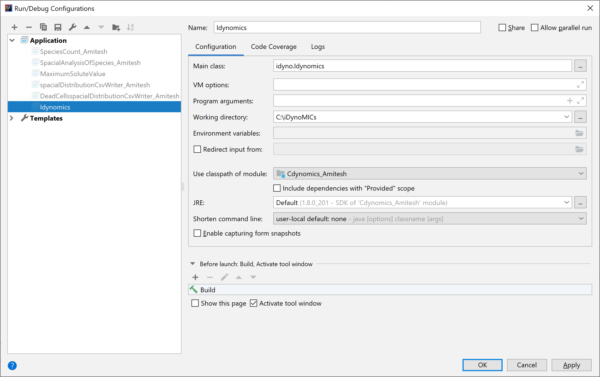

# 3. Configure simulation
## 3.1. Get the protocol of simulation
Write or copy existing protocol as .xml-file to folder ```protocols``` of main iDynoMICs folder.

## 3.2. Specify your protocol location for simulation
Open file ```Constants.java``` located in ```'iDynoMICs_root_folder'/src/SearchEngine/Constants.java```. In my case it is: ```C:/iDynoMICs/src/SearchEngine/Constants.java``` and edit values of variables:
- ```OUTPUT_PATH``` : ```'iDynoMICs_root_folder'\\results\\Out.txt```
- ```RESULT_PATH``` : ```'iDynoMICs_root_folder'\\results```
- ```XML_PATH``` : ```'iDynoMICs_root_folder'\\protocols\\'your_protocol_name'.xml```

In my case they were:
- ```OUTPUT_PATH``` : ```C:\\iDynoMICs\\results\\Out.txt```
- ```RESULT_PATH``` : ```C:\\iDynoMICs\\results```
- ```XML_PATH``` : ```C:\\iDynoMICs\\protocols\\test_protocol.xml```

Save your changes.

## 3.3. Run simulation
You can now run simulation with one of following ways:
1. Press ```Shift```+```F10```
2. Go to ```Run``` -> ```Run Idynomics```
3. Hit the run button:
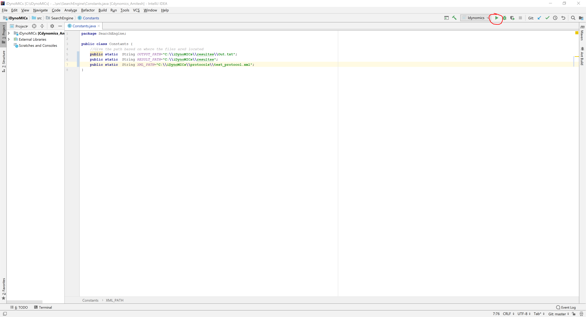
